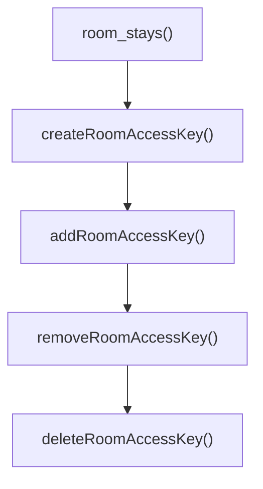

# This is custom theme for SpectaQL with additional features

## SpectaQL config options

These settings apply only to the `spectaql-config.yml` file. The default configuration continues to function as usual and the options listed below simply introduce additional features.

### Setting up logo

If the logo is defined via `spectaql.logoFile` or `spectaql.logoUrl` setting, it's mandatory to add `spectaql.logoHeightPx` setting, otherwise your provided logo won't be shown.

### Custom Field Expansion Depth

You can also put field expansion depth values for seperate queries or mutations using `introspection.customFieldExpansionDepth.{Schema coordinates}` setting which will override `fieldExpansionDepth` setting for those queries and mutations. For example:

```yml
introspection:
    customFieldExpansionDepth:
        Query.categories: 4
        Mutation.returnOrderCreate: 4
```

### Mermaid charts (optional)

This custom spectaql theme supports mermaid charts processing in `x-introItems` and `x-outroItems`. In order for it to work you must specify `mermaid` javascript build file with `spectaql.mermaidPath` setting.

### Sort alphabetically

By default `Operations`, `Types` and `Directives` are sorted alphabetically, but if you want to sort it by how it is written in your GraphQL schema, you must set `spectaql.sortAlphabetically` setting value as false. 

### Custom Theme Colors

You can customize the appearance of your SpectaQL documentation by defining color variables. There's separate color configurations for **light** and **dark** themes using the following settings:

- `spectaql.themeVariables.lightTheme`
- `spectaql.themeVariables.darkTheme`

Both themes support the same set of color variables.

#### Available Color Variables

```
--spectaql-background // Primary color for the documentations background
--spectaql-background-subtle // Theme toggle button, endpoints and examples
--spectaql-text-color // Primary color for documentations text
--spectaql-text-color-subtle // Nav group titles, labels, section headings, and placeholders
--spectaql-link-color // Primary accent color for links, active states, and focus indicators
--spectaql-link-color-hover // Hover state for all interactive links and elements
--spectaql-border-color // Primary border for dividers, toggles, and component edges
--spectaql-border-color-subtle // Subtle dividers within tables and argument lists
--spectaql-code-background // Background for all code blocks
--spectaql-code-background-subtle // Background for inline code inside tabbed content
--spectaql-code-text-color // Code block text color
--spectaql-sidebar-background // Background for sidebar and group headings
--spectaql-examples-background // Background for the examples panel
--spectaql-scrollbar-thumb // Custom scrollbar thumb color
--spectaql-table-stripe // Striped row color for tables
--spectaql-nav-group-title // Nav group title text color
--spectaql-group-name-bg // Background for operation/definition group name tags
--spectaql-group-name-bg-hover // Hover background for operation/definition group name tags
--spectaql-group-name-color // Text color for operation/definition group name tags
--spectaql-code-copy-bg // Background for copy button and search clear button
--spectaql-code-copy-bg-hover // Hover background for copy button and search clear button
--spectaql-code-copy-color // Icon color for copy button
--spectaql-code-copy-color-hover // Icon hover color for copy button
--spectaql-code-copy-success // Checkmark icon color after successful copy
--admonition-warning-bg // Warning admonition background
--admonition-warning-border // Warning admonition left border accent
--admonition-warning-title-color // Warning admonition title text color
--admonition-warning-title-bg // Warning admonition title background
--admonition-info-bg // Info admonition background
--admonition-info-border // Info admonition left border accent
--admonition-info-title-color // Info admonition title text color
--admonition-info-title-bg // Info admonition title background
--admonition-danger-bg // Danger admonition background
--admonition-danger-border // Danger admonition left border accent
--admonition-danger-title-color // Danger admonition title text color
--admonition-danger-title-bg // Danger admonition title background
--text-highlight-bg // Inline text highlight background
--text-highlight-color // Inline text highlight text color
--hljs-background // Syntax highlighter block background
--hljs-color // Syntax highlighter base text color
--hljs-comment // Syntax highlighter comment and quote color
--hljs-keyword // Syntax highlighter keyword and formula color
--hljs-name // Syntax highlighter tag name and selector color
--hljs-literal // Syntax highlighter literal value color
--hljs-string // Syntax highlighter string and regex color
--hljs-attr // Syntax highlighter attribute, variable, and type color
--hljs-number // Syntax highlighter numeric value color
--hljs-title // Syntax highlighter title, link, and meta color
--hljs-built-in // Syntax highlighter built-in and class name color
--hljs-code // Syntax highlighter inline code color
```

You can check which variable a specific element is using via the `inspect` tool in the `style` section in your browser.

#### Example Configuration

```yml
spectaql:
  themeVariables:
    lightTheme:
      --spectaql-background: "#ffffff"
      --spectaql-text-color: "#1a1a1a"

    darkTheme:
      --spectaql-background: "#000000"
      --spectaql-text-color: "#921028"
```

### x-outroItems

`x-outroItems` appends additional documentation sections **after** the auto-generated API reference content.

It mirrors the structure of SpectaQL's built-in `x-introItems`, but renders its content at the **end** of the documentation rather than the beginning.

#### Configuration

Use `info.x-outroItems` to define additional sections. Each entry represents a titled section and can optionally include nested items that link to individual Markdown files.

```yaml
x-outroItems:
  - title: section title
    items:
      - title: title
        file: ./pathToFile
```

## x-introItems and x-outroItems additional processing features

These features are available when writing Markdown files used in `x-introItems` or `x-outroItems` sections. They extend standard Markdown syntax with additional formatting and interactive components.

### Admonition blocks

Admonition blocks let you highlight important information in your documentation using simple, readable markup that renders as styled callout blocks.

#### Syntax

To use an admonition block in a Markdown file, wrap your content between `$$TYPE` and `$$`:

```
$$WARNING
title: Be Careful
This action cannot be undone.
$$
```

#### Supported Types

| Type      | Description                                      |
|-----------|--------------------------------------------------|
| `WARNING` | Cautions the reader about potential issues       |
| `INFO`    | Provides helpful supplementary information       |
| `DANGER`  | Highlights critical or destructive actions       |

#### Title

The `title:` field is optional. If omitted, the title defaults to the admonition type (e.g. `WARNING`, `INFO`, `DANGER`).

```
$$INFO
No title defined here — will default to "INFO".
$$
```

#### Notes

- The pattern matching is **case-insensitive**, so `$$warning`, `$$Warning`, and `$$WARNING` are all valid.
- Admonition blocks can span multiple lines.

### Text highlighting

Text highlighting lets you visually emphasize inline content in your documentation by wrapping text in a simple syntax that renders as a highlighted mark.

#### Syntax

Wrap any text between double equals signs to highlight it:

```
This is ==highlighted text== in a sentence.
```

### Tabbed content

Tabbed content lets you present multiple variants of content — such as code examples in different languages or platform-specific instructions — under a single switchable tab component.

#### Syntax

Wrap your tabbed content between `$$generic` and `$$`, and define each tab using `=== "Tab Title"`:

```
$$generic
=== "JavaScript"
    console.log("Hello World")

=== "Python"
    print("Hello World")
$$
```

> Each tab's content must be **indented with 4 spaces**. This indentation is stripped automatically during processing.

#### Notes

- Tab titles must be **quoted** (e.g. `=== "My Tab"`)

### Mermaid charts

Mermaid charts let you embed diagrams and flowcharts directly in your documentation using simple text-based syntax that renders as visual graphics.

#### Syntax

Wrap your Mermaid diagram in a `mermaid` code block:

````

````

> For mermaid charts to work, you **MUST** do processing file setup instructions, see [Mermaid charts](#mermaid-charts-optional) under **SpectaQL config options**.

# Examples

### SpectaQL config file example

You can see a working minimal file named `spectaql-config.example.yml` with all custom settings in use.

### Dynamic Example Processing Module example

You can see a working example of a dynamic example processing module named `dynamicExamplesProcessingModule.example.js`. It demonstrates how to return realistic example values for GraphQL fields based on field name, type name, or parent type.