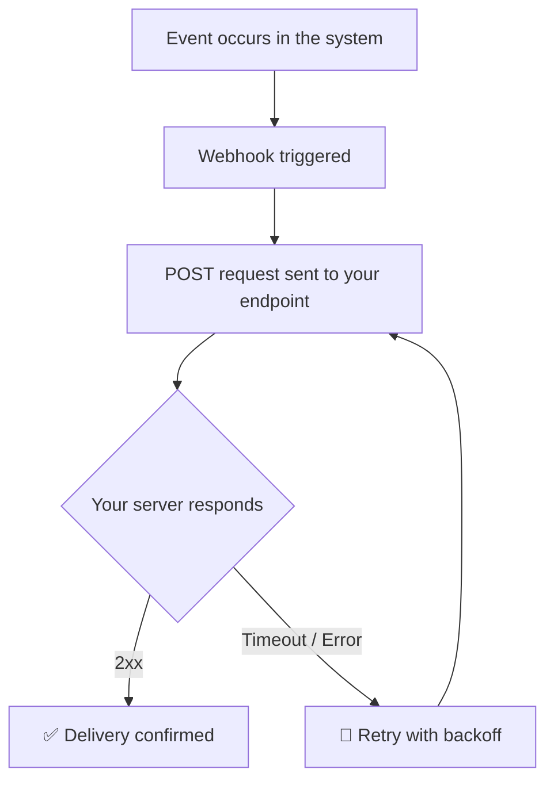

# Webhooks Overview
 
Webhooks allow your application to receive real-time notifications when events occur in the system. Instead of polling the API repeatedly, you can register a URL and we will send HTTP POST requests to it whenever relevant events are triggered.
 
## How It Works
 
When an event occurs, the system sends a signed HTTP POST request to your configured webhook endpoint containing a JSON payload with the event details. Your server must respond with a `2xx` status code within the timeout window to confirm receipt.
 

 
## Registering a Webhook
 
You can register a webhook endpoint via the GraphQL API using the `createWebhook` mutation. Each webhook requires a valid HTTPS URL and a list of event types to subscribe to.
 
$$INFO
Webhook endpoints must use HTTPS. Plain HTTP endpoints will be rejected to ensure secure delivery of event data.
$$
 
### Signature Verification
 
Each request includes an `X-Webhook-Signature` header containing an HMAC-SHA256 signature of the raw request body, signed with your webhook secret. Always verify this before processing.
 
==Signature verification==

$$generic
=== "Node.js"
```
    const crypto = require("crypto");

    function verifySignature(secret, payload, signature) {
        const hmac = crypto.createHmac("sha256", secret);
        hmac.update(payload, "utf8");
        const digest = "sha256=" + hmac.digest("hex");
        return crypto.timingSafeEqual(
            Buffer.from(digest),
            Buffer.from(signature)
        );
    }
```

=== "Python"
```
    import hmac
    import hashlib

    def verify_signature(secret: str, payload: bytes, signature: str) -> bool:
        digest = "sha256=" + hmac.new(
            secret.encode("utf8"),
            payload,
            hashlib.sha256
        ).hexdigest()
        return hmac.compare_digest(digest, signature)
```

=== "PHP"
```
    function verifySignature(string $secret, string $payload, string $signature): bool {
        $digest = "sha256=" . hash_hmac("sha256", $payload, $secret);
        return hash_equals($digest, $signature);
    }
```
$$